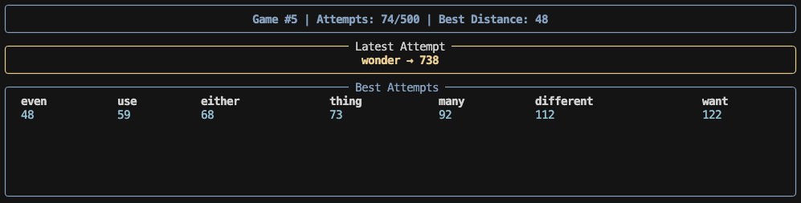
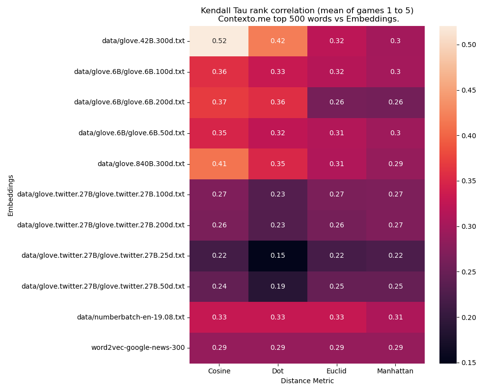
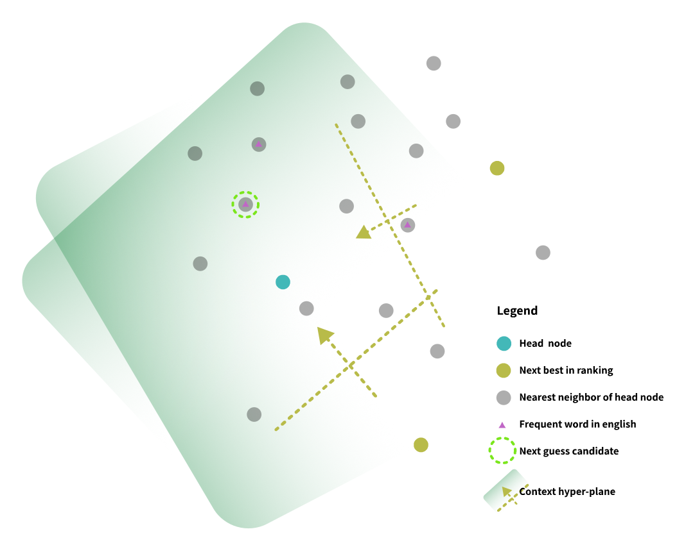

# Contexto.me benchmark

Contexto.me ranks each guessed word based on how semantically close it is to the hidden target word.
The closer a word is in meaning, the higher its position in the ranking (the lower the value the better).

Given only the ranking feedback from each guess,
your goal is to design a strategy that finds the hidden word in as few attempts as possible.

## What's inside

- Pre-made vector space with GloVe embedings using Qdrant.
- Library that allows you to forget about interfacing with the Contexto.me server.
- Nice dashboard to see your algorithm running live for fun/debugging purposes.
- Multithreaded eval script to actually benchmark your algorithm.
- Baseline strategies that you can benchmark against.

## Set up

To run this benchmark you will need to download the repo and install the dependencies.

```bash
# Optionally, create a conda env
conda create -n contexto python=3.11 -y
conda activate contexto

# clone repo
git clone https://github.com/fcossio/contexto-benchmark.git
cd contexto-benchmark

# install dependencies
pip install -r requirements.txt

# download embeddings
python prepare_data.py download-all
```

## Implement your own algorithm

To be able to compare your algorithm, follow these steps.

1. Create a subclass of the class [`ContextoBase`](environment.py) in the [strategies.py](strategies.py) file (you will be able to see some baseline examples there).

2. Register your algorithm in [strategies.py](strategies.py)

    ```python
    # ... other code ...
    class MyGreetingAlgo(ContextoBase):
        def take_turn(self):
            word = "hello"
            return self.make_guess(word)

    register_strategy("my_greeting_algo", MyGreetingAlgo)
    ```
3. Run a single game for fun or debugging purposes
    ```bash
    python cli.py play <strategy> <game_id>
    # example
    python cli.py play my_greeting_algo 5
    ```
    You will see the `rich` dashboard ✨
    

4. Benchmark the the algorithm. The following command will launch 5 games in parallel and repeat 3 times to get a sense of the variance of the algorithm (and reduce cherrypicking results).
   ```
   python cli.py eval <strategy> 1 2 3 4 5 --num-runs 3
   ```

   You will get an output that shows something like below that should be pasted into the [benchmark-results.jsonl](data/benchmark-results.jsonl) 
   ```
    {"strategy": "context_search_stochastic", "game_id": 1, "mean": 162.33333333333334, "std": 66.24365797736583, "attempts": [174, 237, 76]}
    {"strategy": "context_search_stochastic", "game_id": 2, "mean": 278.3333333333333, "std": 175.04539093871878, "attempts": [393, 411, 31]}
    {"strategy": "context_search_stochastic", "game_id": 3, "mean": 257.6666666666667, "std": 30.346151137976115, "attempts": [283, 215, 275]}
    {"strategy": "context_search_stochastic", "game_id": 4, "mean": 196.66666666666666, "std": 81.96069518711731, "attempts": [248, 81, 261]}
    {"strategy": "context_search_stochastic", "game_id": 5, "mean": 132.0, "std": 39.824615503479755, "attempts": [187, 94, 115]}
   ```

   Afterwards you can get a plot that compares the different implementations.
   It will read the results json and recreate [benchmark.md](data/benchmark.md).
   ```
   python cli.py report
   ```


## Pre-made vector space

Since we want to evaluate the search algorithms, we need a benchmarking search space that resembles the space used inside the game. The embeddings that best match the game's semantics that I could find is `glove.42B.300d`. The rank correlation of top 500
words in the first 5 games for multiple candidates is shown in the following plot. Maybe you can find a better
embeddings? Feel free to compare them in the [embedding_experiments.ipynb](embedding_experiments.ipynb) notebook.

For completeness multiple metrics where checked for each embeddings just in case the 
creators of the game didn't use the defaults for their selected model.



The default `ContextoBase.qdrant` vector space has three metadata fields that are useful:

1. `in_game`: All words start with value `True`. If, after guessing, Contexto.me does not recognize the word or suggests a different lemma, it gets automatically switched to `False`.
1. `best_distance`: All words start with value `0`. After a guess, the value gets updated with the distance obtained from the server. It can be used for filtering out words that have been guessed.
1. `freq`: If the word is within the top 5000 most common words. It will have a value between 0.0 (least common) and 1.0 (most common). This value can be used to score your potential next guesses.

Common functionalities for interfacing with the vector space are in the [glove.py](glove.py) file.

## Baseline algorithms

### Nearest Descent

The simplest algorithm I could think of.

1. Start with a random word and make a guess.
1. Repeat until target word is found:
   1. Find the nearest neighbor of the word that is at the top of the ranking.
   1. Make a guess, update the ranking.

### Nearest Descent with Multiple Starts:

Same as above but make N random guesses in the beginning to reduce the chances of starting too far off from the target.

### Context search

The idea is to use Qdrant's context search API to 'siege' the target word by re-ranking the nearest words to the known best that are more distant to the older guesses.
    
1. Start by guessing 5 random words.
1. Find the nearest 100 words to the head (closest word).
1. Use the head word as positive and the next 5 as negatives to create multiple hyperplanes to guide the search. 
   An implementation detail is that the Qdrant API returns a lot of 0.0 for all the ones close to the positive. Since we want to get some signal from just a few hyperplanes, we can reverse the hyperplane by  switching the positive and negative arguments and then multiplying the scores by -1.0 and resorting. For details, see the code. https://github.com/fcossio/contexto-benchmark/blob/65314eba270eda07c309c757c189a22dbe945d7f/glove.py#L251
1. Factor in if the word is a frequent word in english.
1. Make the guess with the highest conextual score that is close to the head.
1. When close enough (distance <= 40), switch to greedy search 80% of the guesses, as it helps to converge faster when close to the target.

One benefit of this approach is that if the latest guessed word is not within the top 5 candidates, there is no need to re-compute the candidates (unless we run out of the 100 candidates of course). Which makes it a bit faster.

A conceptual image of this approach is shown below.



To see this solution in action please use
```
python cli.py play context_search 6
```

### Context search stochastic

This is a variation of the above where N context pairs are selected at random from the ranking taking care of always pointing towards the lowest distance word in the pair and without repeating pairs. (Spoilers, it didn't help).


## Results

The benchmark results were generated in [benchmark.md](data/benchmark.md).
